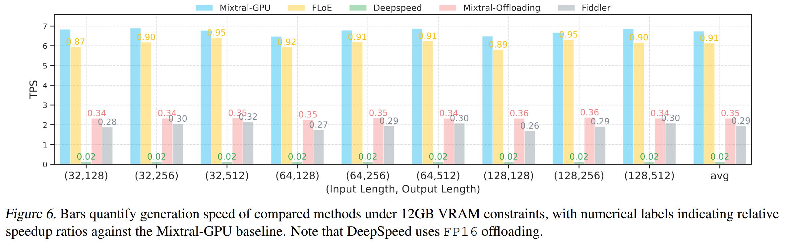

# Introduction
MoE模型是一种计算友好型专家，适合在端侧设备这种计算能力偏弱的场景下部署。
但由于MoE模型本身占据大部分内存，而端侧设备内存有限，所以目前大部分方法采取offloading范式将模型参数下放到更低级的存储结构。
当前基于Next Layer prediction的预取方法通过预测下一层专家，来预取下一层专家，从而减少数据依赖带来的推理延迟
 
但是由于在端侧IO时间和计算时间很难Overlap住，所以我们从减少单次IO负担和减少IO次数的角度来缓解IO的负担：
- **减少单次IO的负担**：Expert sparsity （+Quantization）

> 减少IO次数：next token prediction 来将下一个token可能激活的专家提前load上来（但是似乎也不会减少IO次数）

# TODO
## Design
- Sparsity之后，是不是next layer 也能改进，改进之后是不是就不需要next token了
  - FloE结果显示（RTX 3090），在每个专家9.3倍的参数压缩量下，相较于naive的next layer prediction提高**三倍**的速度，理想推理速度的90%
  - **Next token prediction 必要性较弱？**

- 计算图
  - 使用后一层的gate乘hidden state来做Next layer prediction（90% acc），load专家，（有错的需要按需load，保证正确性（deepseek v2 lite有3%的acc下降））
  - 然后将up矩阵全部load上来（maybe量化），进行sparsity的计算，然后根据sparsity的结果load gate和down
  

## Method
- prefill peek mem control
  - prefill阶段为每个expert分配不同buffer，non expert在同一块位置，但是后面层的expert不load上来，然后计算的时候，先开启IO来load后面的层，然后算一层释放（从这个tensor的基址开始free，将基址后面的size空间设为un used）一层tensor的buffer，buft不会变
  - decode阶段，为expert重新分配buffer空间，对non expert不需要做处理
  - 最后模型会对pimpl的buffer进行释放
    - 
  - 先加载再写文件
- Sparsity 
  - mat计算过程：权重和矩阵乘的关系是否正确
  - IO
  - 计算
- 异步IO
  - 提交IO任务后返回，需要用的到的时候看on_fly标志
  - begin end算子
- 缓存管理
  - 缓存空间是全局还是每层平均
  - 管理有哪些专家，以及替换的优先级
- Next layer prediciton适配
  - 先查找当前层的缓存，load on-demand专家，然后在moe计算和next token计算的时候开IO去预取下一层的专家

## Experiment
- IO与计算时间【DONE】
  - 下一层预测准确，还存在IO和计算的差异问题吗
    - 存在
- **各个不同模型的expert的大小不同，需要测量**【DONE】
  - 我们在端侧应该不是测试mixtral这种更大的模型，而是要测比Deepseek-v2-Lite更小的模型的计算与IO的时间
  - 大的也得测，用上峰值控制
- sparsity预测idx当成ground truth会有多少的acc损失

